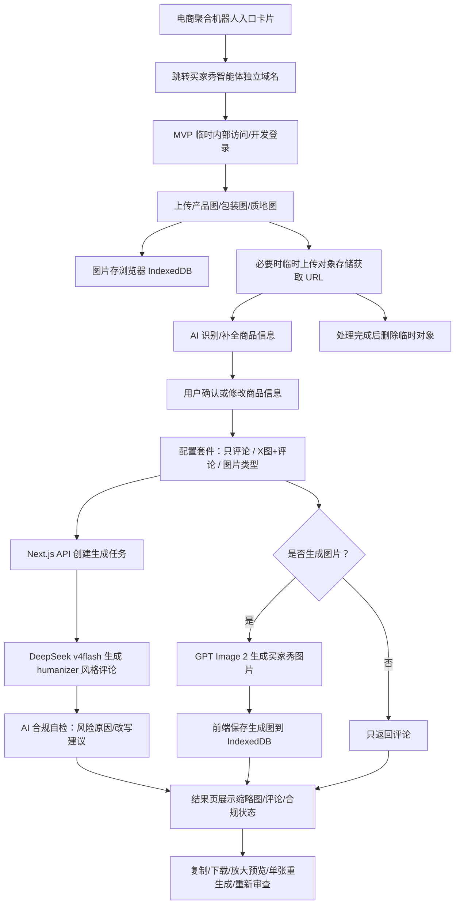

# 买家秀智能体 PRD

## 1. 核心目标（Mission）

为公司店铺运营团队提供一个独立的买家秀图文生成智能体，快速生成护肤、美妆商品评论区可用的图文草稿，降低人工拍摄和评论写作成本，并通过 AI 自检辅助运营把控内容风险。

## 2. 用户画像（Persona）

目标用户是公司内部店铺运营人员。

他们的核心痛点：

- 商品评论区缺少买家秀素材。
- 自己拍摄产品图、质地图、场景图效率低。
- 手写真实感评论耗时，且容易写成广告腔。
- 护肤、美妆类目存在功效表达、敏感词、平台风控等风险。
- 运营希望批量获得可挑选的图文草稿，但最终发布前仍由人工审核。

产品定位是“运营草稿生成工具”，不是自动发布工具。所有生成内容都由运营最终把关。

## 3. V1：最小可行产品（MVP）

### 3.1 核心功能

1. 上传素材
   - 分区上传产品图、包装图、质地图。
   - 支持单张或多张上传。
   - 多张图用于帮助 AI 理解同一个商品，而不是批量处理多个商品。

2. 商品信息填写与 AI 补全
   - 用户可填写商品名称、功效、适用肤质、使用感、重点卖点、避免表达。
   - 如果用户不填写商品信息，AI 根据上传素材自动补全一版商品信息。
   - 用户填写的信息优先级高于 AI 推断信息。
   - 商品信息来源需要标记为 `manual`、`ai_inferred` 或 `mixed`。

3. 配置生成套件
   - 用户可创建 A/B/C 等多个套件。
   - 每个套件独立配置生成内容。
   - 支持只生成评论。
   - 支持生成 `X 张图 + 1 条评论`。
   - 用户手动选择图片类型。

4. 图片类型
   - 质地上手图。
   - 浴室/化妆台场景图。
   - 真人自拍持产品图。
   - MVP 支持完整人脸出镜。

5. 评论生成
   - 评论语气以真实素人为主。
   - 必须参考 `blader/humanizer` 项目的去 AI 味思路。
   - 避免模板腔、广告腔、夸张功效承诺、过度工整排比。
   - 鼓励具体但不过度完美的使用感、轻微口语化、自然转折。

6. AI 自检
   - 后端对评论做敏感风险、功效夸大、平台风险检查。
   - 返回合规状态、风险原因、改写建议。
   - 自检只做提示，不强制拦截。
   - 不通过内容仍允许复制和下载，由运营最终判断。

7. 生成结果页
   - 按套件展示结果。
   - 优先展示缩略图、评论文本、合规状态。
   - 支持点击缩略图放大预览。
   - 支持复制评论、下载图片、单张图片重生成、评论重生成、重新审查。
   - 用户手动修改评论后，可重新审查，也可直接复制。

### 3.2 MVP 不做

- 素材库。
- 正式审核流。
- 批量商品任务。
- 批量导出。
- 平台/品牌词库后台。
- 多人协作。
- 图片质量自检。
- SSO 权限接入。

## 4. V2 及以后版本（Future Releases）

- 接入电商聚合机器人的 SSO 跳转和权限管理。
- 在电商聚合机器人首页或机器人广场增加入口卡片。
- 素材库和历史结果管理。
- 正式审核流和发布前确认流。
- 批量商品任务。
- 批量导出。
- 平台/品牌词库配置。
- 不同平台评论格式适配。
- 图片质量自检：手部、人脸、产品一致性、场景真实感。
- 商品资料复用与 SKU 模板。
- 运营数据统计：生成量、采纳率、风险率、重生成率。

## 5. 关键业务逻辑（Business Rules）

- 内容定位为运营草稿素材，发布前由运营最终审核。
- 用户可只生成评论，也可生成 `X 张图 + 1 条评论`。
- 用户可创建多个生成套件，每个套件独立配置图片数量、图片类型和评论需求。
- 商品信息不是必填项。用户未填写时，系统使用 AI 根据上传素材补全。
- 用户填写的信息优先级高于 AI 推断信息。
- 评论生成必须参考 `blader/humanizer` 的真人化表达原则。
- 后端评论自检只提示风险，不强制拦截。
- 不通过内容仍允许复制和下载。
- 用户修改评论后，可选择重新审查，也可直接复制。
- 图片自检不进入 MVP。
- 每张图片支持单独重生成。
- 数据库保留任务元数据和评论等文本记录 30 天。
- 用户可手动删除历史记录。
- 图片文件不长期保存在数据库。
- 上传图和生成图优先保存在用户浏览器本地。
- 换电脑或换浏览器后，历史图片不可见是可接受限制。
- 解析上传产品图生成评论时，可临时上传对象存储获取 URL，再发给大模型。
- 模型处理完成后，临时对象应删除。

## 6. MVP 体验设计

### 6.1 选定原型

选定方案：左侧向导 + 右侧实时摘要。

选择理由：

- 保留分步引导，适合运营第一次使用。
- 左侧固定展示步骤和当前商品摘要，用户不容易迷路。
- 右侧主区域承载卡片式套件配置，适合 A/B/C 多套生成。
- 后续接入历史、素材库、词库、SSO 时扩展空间较好。

### 6.2 核心流程

```text
上传素材 → 填商品信息 → 配置套件 → 生成结果
```

### 6.3 ASCII 原型

```text
┌────────────────────────────────────────────────────────────────────┐
│ 买家秀智能体                                          [返回/退出]    │
├───────────────┬────────────────────────────────────────────────────┤
│ 步骤           │ ③ 配置套件                                         │
│ ✓ 上传素材     │                                                    │
│ ✓ 商品信息     │ ┌──────────────────────────────────────────────┐   │
│ ● 配置套件     │ │ 套件 A：只生成评论                             │   │
│ ○ 生成结果     │ │ 评论数量 1   语气：真实素人                    │   │
│               │ └──────────────────────────────────────────────┘   │
│ 当前摘要       │ ┌──────────────────────────────────────────────┐   │
│ 产品：面霜     │ │ 套件 B：X图 + 1评论                            │   │
│ 肤质：干皮     │ │ 图片数量：用户自定义  图片类型：[真人自拍持产品] │   │
│ 功效：保湿     │ └──────────────────────────────────────────────┘   │
│               │ ┌──────────────────────────────────────────────┐   │
│ 信息来源：AI+手动│ │ 套件 C：多图 + 1评论                         │   │
│               │ │ 图片数量：用户自定义                          │   │
│               │ │ 图片类型：[质地上手] [化妆台] [自拍持产品]      │   │
│               │ └──────────────────────────────────────────────┘   │
│               │ [+ 添加套件]                         [开始生成]    │
└───────────────┴────────────────────────────────────────────────────┘
```

### 6.4 套件结果预览

```text
┌────────────────────────────────────────────────────────────────────┐
│ 套件 B｜X图 + 1评论｜合规：通过                                     │
├──────────────────────┬─────────────────────────────────────────────┤
│ ┌──────────────────┐ │ 评论文本                                    │
│ │     图片缩略图     │ │ 包装挺清爽的，拿在手里不廉价。质地是水润一点 │
│ │   点击放大预览     │ │ 的乳霜感，推开不会一坨一坨的...             │
│ └──────────────────┘ │                                             │
│                      │ 自检：未发现明显高风险表达                  │
├──────────────────────┴─────────────────────────────────────────────┤
│ [复制评论] [下载图片] [重生成单图] [重生成评论] [重新审查]            │
└────────────────────────────────────────────────────────────────────┘
```

## 7. 技术架构

### 7.1 项目形态

买家秀智能体采用独立项目，而不是直接嵌入电商聚合机器人主项目。

项目目录：

```text
/Users/a123/Desktop/买家秀1
```

独立项目的原因：

- 买家秀智能体会频繁迭代，独立部署更轻。
- 避免每次小改都触发电商聚合机器人主站重新部署。
- 图片生成、评论规则、合规自检、套件配置都适合独立演进。
- 后续商业化或迁移给其他团队更方便。

### 7.2 技术选型

- Next.js 全栈：页面和 API Route 放在同一项目里，适合轻量独立部署。
- TypeScript：降低前后端数据契约出错概率。
- PostgreSQL：使用独立数据库项目。
- Prisma：管理任务、套件、评论、自检等结构化数据。
- IndexedDB：保存用户浏览器本地图片。
- 对象存储：仅用于临时上传图片并获取 URL，供模型解析图片。
- DeepSeek v4flash：评论生成、商品信息补全、评论自检。
- GPT Image 2：买家秀图片生成。

### 7.3 部署与权限

- MVP 暂不接入 SSO。
- MVP 先跑通核心生成流程。
- 后续通过 SSO 与电商聚合机器人账号和权限联动。
- 电商聚合机器人只保留入口跳转，不承载买家秀功能代码。
- 买家秀智能体未来使用单独域名。

## 8. 核心流程图



## 9. 建议模块结构

```text
app/
  page.tsx
  layout.tsx
  buyer-show/
    page.tsx
    BuyerShowAgentClient.tsx
    buyerShowAgent.module.css
  api/
    buyer-show/
      tasks/route.ts
      generate/route.ts
      regenerate-image/route.ts
      regenerate-comment/route.ts
      compliance-check/route.ts
      delete-task/route.ts

lib/
  buyer-show/
    local-images.ts
    schemas.ts
    prompts.ts
    humanizer-rules.ts
    product-info-inference.ts
    comment-generator.ts
    compliance-checker.ts
    image-generator.ts
    object-storage.ts
    prisma.ts

prisma/
  schema.prisma
```

## 10. 数据契约（Data Contract）

```ts
type ProductInfoSource = "manual" | "ai_inferred" | "mixed";

type BuyerShowTask = {
  id: string;
  externalUserId?: string;
  productName?: string;
  category: "skincare" | "beauty" | "unknown";
  productInfoSource: ProductInfoSource;
  productClaims: string[];
  skinTypes: string[];
  usageFeel?: string;
  avoidTerms: string[];
  inferredProductInfo?: InferredProductInfo;
  status: "draft" | "generating" | "completed" | "failed";
  createdAt: string;
  expiresAt: string;
};

type InferredProductInfo = {
  category: string;
  productType: string;
  texture: string;
  packageFeatures: string[];
  suggestedClaims: string[];
  suggestedSkinTypes: string[];
  confidence: number;
};

type UploadedAsset = {
  id: string;
  taskId: string;
  type: "product" | "package" | "texture";
  localPreviewKey?: string;
  temporaryObjectUrl?: string;
  deletedAfterProcessing: boolean;
};

type GenerationSet = {
  id: string;
  taskId: string;
  name: string;
  mode: "comment_only" | "image_with_comment";
  imageCount: number;
  imageTypes: Array<"texture_on_hand" | "bathroom_vanity" | "selfie_holding_product">;
  commentCount: number;
};

type GeneratedResult = {
  id: string;
  setId: string;
  images: GeneratedImage[];
  comment: GeneratedComment;
  createdAt: string;
};

type GeneratedImage = {
  id: string;
  type: "texture_on_hand" | "bathroom_vanity" | "selfie_holding_product";
  localImageKey: string;
  promptSnapshot: string;
};

type GeneratedComment = {
  id: string;
  text: string;
  tone: "real_user";
  complianceStatus: "passed" | "needs_review";
  complianceReasons: string[];
  rewriteSuggestion?: string;
  promptSnapshot: string;
};

type CommentGenerationRules = {
  reference: "https://github.com/blader/humanizer";
  tone: "real_user";
  avoid: string[];
  prefer: string[];
};
```

## 11. 评论生成规则

评论生成必须参考：

```text
https://github.com/blader/humanizer
```

核心原则：

- 不写成广告文。
- 不写成 AI 模板文。
- 不堆砌夸张形容词。
- 不使用绝对化功效承诺。
- 不编造无法从素材或商品信息支撑的医学、修复、美白等强功效。
- 多写真实使用感，而不是空泛推荐。
- 允许轻微口语化和自然停顿。
- 可以出现适度保留意见，让评论更像真实用户。

示例风格：

```text
包装挺清爽的，拿在手里不廉价。质地是那种水润一点的乳霜感，推开不会一坨一坨的，吸收完脸上有点柔光，不是油亮。早上出门前用也还行，后续叠防晒没有搓泥。味道不重，这点我比较喜欢。整体算是会继续用的一支。
```

## 12. 风险与应对

### 12.1 完整人脸生成质量不稳定

风险：真人自拍持产品图可能出现脸部不自然、手部异常、产品变形。

应对：

- MVP 支持单张重生成。
- 图片质量自检放到 V2。
- 提示词中强化真实光线、真实手部、产品一致性。

### 12.2 产品一致性不足

风险：AI 生成图里的包装、颜色、质地可能和原产品不一致。

应对：

- 上传素材分为产品图、包装图、质地图。
- 生成 prompt 中明确引用产品外观和包装特征。
- 结果页允许单张重生成。

### 12.3 浏览器本地图片丢失

风险：用户清缓存、换设备、换浏览器后看不到历史图片。

应对：

- MVP 明确这是内部工具可接受限制。
- 数据库仍保留任务元数据、评论、自检结果 30 天。

### 12.4 临时对象存储清理失败

风险：模型解析使用的临时 URL 未及时删除。

应对：

- 后端处理完成后主动删除。
- 对象存储配置生命周期自动清理。

### 12.5 合规自检误判

风险：AI 自检可能漏判或误判。

应对：

- MVP 只做提示，不做强拦截。
- 运营最终判断。
- 后续再沉淀平台/品牌词库。

## 13. 待后续确认

- DeepSeek v4flash API 接入方式。
- GPT Image 2 API 接入方式。
- 对象存储供应商与上传、删除接口。
- MVP 临时内部访问方式。
- 独立域名和部署平台。
- 后续 SSO 对接电商聚合机器人的具体协议和参考项目。
